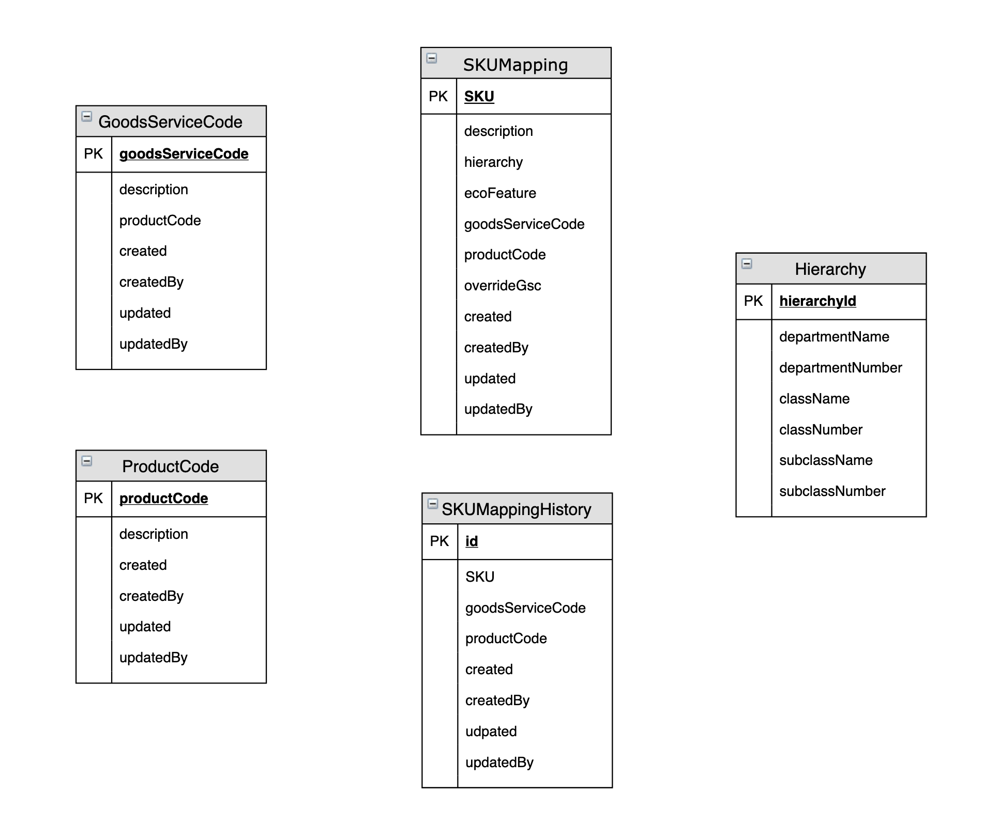

# Cartogram #

## Version 2 DB Schema ##

Part of the rewrite includes envisioning a database that is more normalized from the V1 database. Here is an example of a proposed V2 schema

## REST API ## 

### SKU ###

| Endpoint | GET | PUT | POST | DELETE |
|:---------|:---:|:---:|:----:|:------:|
| /api/v2/sku/{sku} | X | X | X | X |
| /api/v2/sku/{sku}/mapping | X | X | X | X |
| /api/v2/sku/{sku}/mapping/history | X |   |   |   |
| /api/v2/ecoFeatures/ |   | X | X | X |
| /api/v2/ecoFeatures/{ecoFeature}/skus | X |   |   |   |
| /api/v2/hierarchy/  |   | X | X | X |
| /api/v2/hierarchy/department/{department}  | X |   |   |   |
| /api/v2/hierarchy/department/{department}/class/{class}  | X |   |   |   |
| /api/v2/hierarchy/department/{department}/class/{class}/subclass/{subclass}  | X |   |   |   |
| /api/v2/productCode/  |   | X | X | X |
| /api/v2/productCode/{productCode}  | X |   |   |   |
| /api/v2/productCode/{productCode}/gsc/{gsc}  |   | X | X | X |
| /api/v2/gsc/  |   | X | X | X |
| /api/v2/gsc/{gsc}  | X |   |   |   |
| /api/v2/gsc/{gsc}/productCode/{productCode} |   | X | X | X |