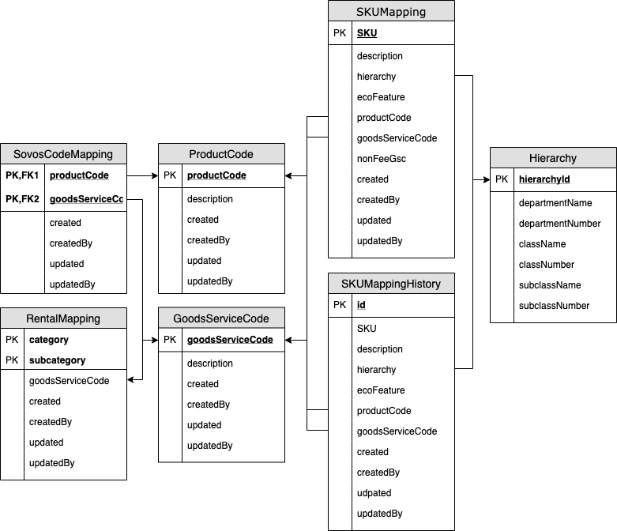

# Cartogram #

## Version 2 DB Schema ##

Part of the rewrite includes envisioning a database that is more normalized from the V1 database. Here is an example of a proposed V2 schema

## REST API ## 

In order to access this database, we need to materialize a REST model of the data.  
The HTTP Methods are _DRAFT_ as discussion is needed on what to allow via HTTP.

### SKU ###

| Endpoint | GET | PUT | POST | DELETE |
|:---------|:---:|:---:|:----:|:------:|
| /api/v2/sku-mappings/ | X |   |   |   |
| /api/v2/sku-mappings/{sku}/ | X | X | X | X |
| /api/v2/sku-mappings/{sku}/history | X |   |   |   |
| /api/v2/sku-mappings/{sku}/history/{id} | X |   |   |   |

## REST API TBD ##
### Hierarchies ###

| Endpoint | GET | PUT | POST | DELETE |
|:---------|:---:|:---:|:----:|:------:|
| /api/v2/hierarchies | X |   | X |   |
| /api/v2/hierarchies/departments/{department}  | X |   | X |   |
| /api/v2/hierarchies/departments/{department}/classes/{class}  | X |   | X |   |
| /api/v2/hierarchies/departments/{department}/classes/{class}/subclasses/{subclass}  | X |   | X |   |

### Product Code,  Goods & Services Codes

| Endpoint | GET | PUT | POST | DELETE |
|:---------|:---:|:---:|:----:|:------:|
| /api/v2/productcodes |   | X | X | X |
| /api/v2/productcodes/{productCode}  | X |   |   |   |
| /api/v2/productcodes/{productCode}/gsc/{gsc}  |   | X | X | X |
| /api/v2/gsc |   | X | X | X |
| /api/v2/gsc/{gsc}  | X |   |   |   |
| /api/v2/gsc/{gsc}/productCode/{productCode} |   | X | X | X |

## Security ## 

We would need to find out how to properly secure each endpoint and allow some kind of RBAC. 

## Analysis of Existing Applications Usage of the V1 Database ##

| Table                | Operation | Cartographer | Minimap | SkuLagoon | MidnightMapper |
|----------------------|-----------|:------------:|:-------:|:---------:|:--------------:|
| DraftMappings        | SELECT    | X            |         |           |                |
| DraftMappings        | INSERT    | X            |         |           |                |
| DraftMappings        | UPDATE    | -            |         |           |                |
| DraftMappings        | DELETE    | -            |         |           |                |
|                      |           |              |         |           |                |
| GSC Edit History     | SELECT    | -            |         |           |                |
| GSC Edit History     | INSERT    | X            |         |           |                |
| GSC Edit History     | UPDATE    | -            |         |           |                |
| GSC Edit History     | DELETE    | -            |         |           |                |
|                      |           |              |         |           |                |
| Product Mappings     | SELECT    | X            |         |           |                |
| Product Mappings     | INSERT    | -            |         |           |                |
| Product Mappings     | UPDATE    | -            |         |           |                |
| Product Mappings     | DELETE    | -            |         |           |                |
|                      |           |              |         |           |                |
| SKU Mappings         | SELECT    | X            |         |           |                |
| SKU Mappings         | INSERT    | X            |         |           |                |
| SKU Mappings         | UPDATE    | X            |         |           |                |
| SKU Mappings         | DELETE    | -            |         |           |                |
|                      |           |              |         |           |                |
| Sku To PC Mappings   | SELECT    | X            |         |           |                |
| Sku To PC Mappings   | INSERT    | X            |         |           |                |
| Sku To PC Mappings   | UPDATE    | X            |         |           |                |
| Sku To PC Mappings   | DELETE    | -            |         |           |                |
|                      |           |              |         |           |                |
| Tax Sensitive DCS    | SELECT    | -            |         |           |                |
| Tax Sensitive DCS    | INSERT    | -            |         |           |                |
| Tax Sensitive DCS    | UPDATE    | -            |         |           |                |
| Tax Sensitive DCS    | DELETE    | -            |         |           |                |
|                      |           |              |         |           |                |
| Tool Rental Mappings | SELECT    | -            |         |           |                |
| Tool Rental Mappings | INSERT    | -            |         |           |                |
| Tool Rental Mappings | UPDATE    | -            |         |           |                |
| Tool Rental Mappings | DELETE    | -            |         |           |                |
|                      |           |              |         |           |                |
| Unmapped SKUs        | SELECT    | X            |         |           |                |
| Unmapped SKUs        | INSERT    | -            |         |           |                |
| Unmapped SKUs        | UPDATE    | -            |         |           |                |
| Unmapped SKUs        | DELETE    | X            |         |           |                |

## References ##

In no particular order

1. https://auth0.com/blog/rest-architecture-part-1-building-api/
1. https://restfulapi.net/rest-api-design-tutorial-with-example/
1. https://restfulapi.net/resource-naming/
1. https://hackernoon.com/restful-api-design-step-by-step-guide-2f2c9f9fcdbf
1. https://www.restapitutorial.com/lessons/restfulresourcenaming.html
1. https://www.moesif.com/blog/api-guide/api-design-guidelines/
